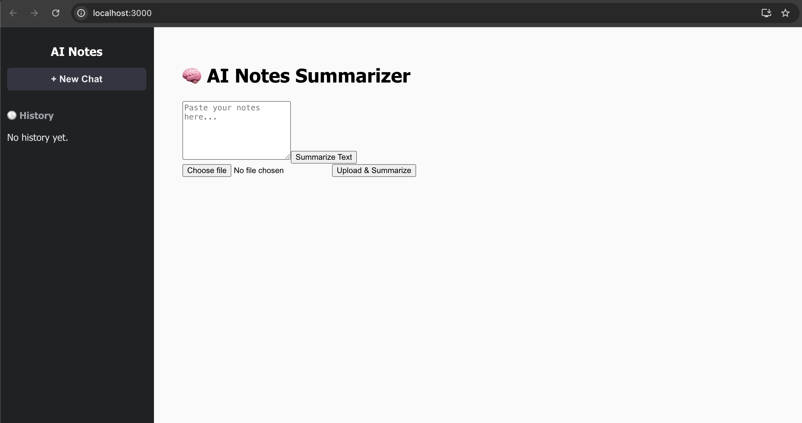

# 🧠 AI Notes Summarizer

AI Notes Summarizer is a full-stack web application that uses React for the frontend and Django for the backend. It allows users to upload `.txt` or `.pdf` files or enter raw text and receive concise AI-generated summaries. The interface features a chat-style sidebar history similar to ChatGPT for seamless navigation between past summaries.

---

## 📸 Screenshots

> Save these screenshots in a `screenshots/` folder inside your project.

### 🏠 Main Interface (Text Input & File Upload)


### 🧾 Chat History Sidebar


### 📋 Summary Result View


---

## 🚀 Features

- 📝 Enter or paste long-form text
- 📁 Upload `.txt` or `.pdf` files
- ⚡ Get quick, AI-powered summaries
- 🕓 View chat-style history (stored in localStorage)
- 🗑️ Delete individual summary entries
- ♻️ Start new chats with a clean interface

---

### ⚙️ Backend – Django (Python)
- **Django** – Web framework for backend API
- **Django REST Framework** – For building REST APIs
- **PyMuPDF (fitz)** – To extract text from PDF files
- **CORS Headers** – To allow communication with frontend
- **SQLite** – Default database
- **File Handling** – Upload and process `.txt` and `.pdf`

### 🌐 Frontend – React
- **React.js** – Interactive frontend SPA
- **Axios** – For sending API requests
- **LocalStorage** – Persistent summary history
- **Custom CSS** – Styled to resemble ChatGPT’s sidebar and layout

---


## ⚙️ Setup Instructions

### Backend (Django)

1. Create a virtual environment:
   ```bash
   python -m venv .venv
   source .venv/bin/activate  # On Windows: .venv\Scripts\activate
